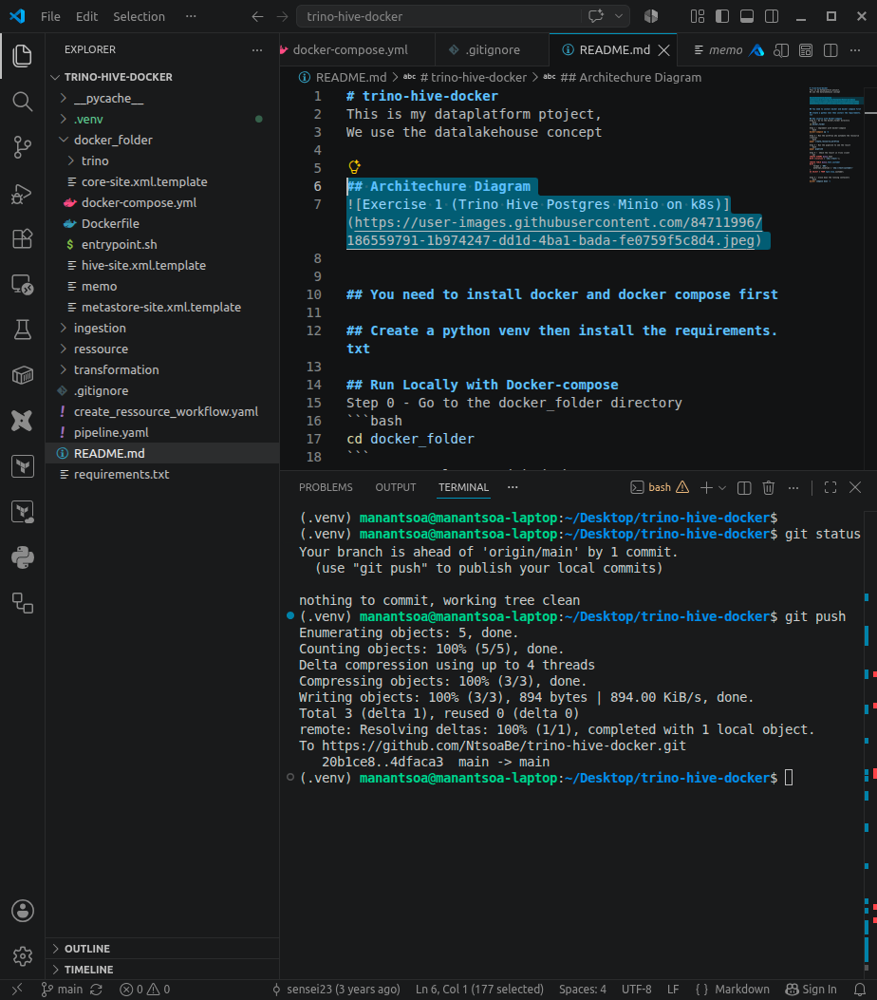

# trino-hive-docker
This is my dataplatform ptoject,
We use the datalakehouse concept


## Architechure Diagram




## You need to install docker and docker compose first

## Create a python venv then install the requirements.txt

## Run Locally with Docker-compose
Step 0 - Go to the docker_folder directory
```bash
cd docker_folder
```
Step 1 - Implement with docker-compose
```bash
docker-compose up -d
```
Step 2 - Run the workflow who automate the ressource creation
```bash
pypyr create_ressource_workflow
```
Step 3 - Run the pipeline to see the result
```bash
pypyr pipeline
```
Step 4 -  Check the result in trino client
```sql
CREATE SCHEMA minio.test
WITH (location = 's3a://test/');

CREATE TABLE minio.test.customer
WITH (
    format = 'ORC',
    external_location = 's3a://test/customer/'
) 
AS SELECT * FROM tpch.tiny.customer;
```

Step 5 - Close down the running containers
```bash
docker compose down -v
```
